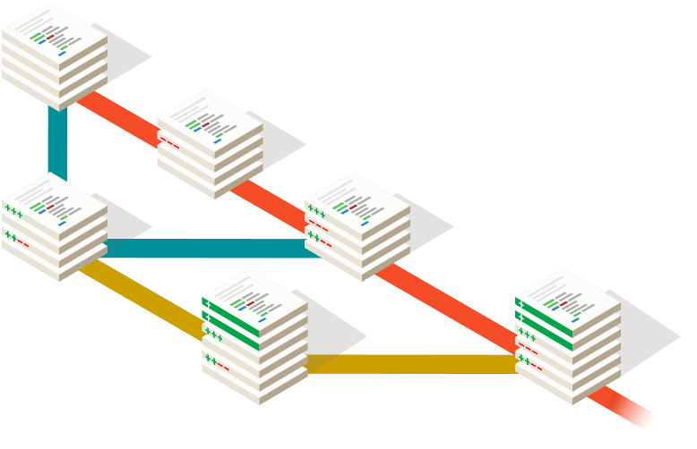
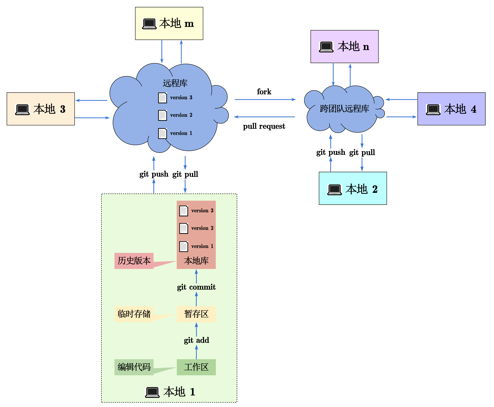

# Git与Git日常开发命令

- [Git与Git日常开发命令](#git与git日常开发命令)
  - [:rocket: 简介](#rocket-简介)
  - [:trophy: Git的工作机制](#trophy-git的工作机制)
  - [:books: Git日常开发命令速查](#books-git日常开发命令速查)
    - [:house: 本地](#house-本地)
    - [:cloud:远程](#cloud远程)
## :rocket: 简介

    

 
    

​    Git 是一个免费的、开源的**分布式版本控制系统**，可以快速高效地处理从小型到大型的各种项目。Git 易于学习，占地面积小，性能极快。 它具有廉价的本地库，方便的暂存区域和多个工作流分支等特性。 

## :trophy: Git的工作机制

使用Git可以进行个人开发、团队开发以及跨团队开发，其分布式的特性使得版本控制能够在本地实现，同时支持远程团队开发，这使得Git非常方便灵活，下面给出了Git的工作机制，当你对Git有一定理解后看这张图也许会有“蓦然回首，那人却在灯火阑珊处”的顿悟。

## :books: Git日常开发命令速查

下面记录Git在日常开发中经常使用的命令，分为**本地**和**远程**，一些重点命令会有相应的练习。练习内容是一款网页版Git小游戏`Learning Git Branching`，非常生动，建议多刷几遍加深记忆。

### :house: 本地

|命令格式|命令作用|练习|
|---|---|---|
|git config --global user.name 用户名|设置用户签名|
|git config --global user.name 邮箱|设置用户签名|
|git init| 初始化本地库|
|git status|查看本地库状态|
|git add 文件名|将改动文件添加暂存区|
|git commit -m “日志信息” 文件名|将改动文件提交本地库，文件名可以省略，如果省略则将暂存区全部提交|[基础篇1](https://learngitbranching.js.org/?locale=zh_CN)
|git commit --amend|本次提交与上一次提交合并为一次提交|[杂项2](https://learngitbranching.js.org/?locale=zh_CN)|
|git reflog|查看简易历史提交记录|
|git log|查看完整历史提交记录|
|git reset --hard 版本号|本地库版本窜梭/撤回提交，默认为--mixed|[高级篇4](https://learngitbranching.js.org/?locale=zh_CN)|
|git revert|远程库撤回提交|[高级篇4](https://learngitbranching.js.org/?locale=zh_CN)|
|git branch 分支名|创建分支|[基础篇2](https://learngitbranching.js.org/?locale=zh_CN)|
|git branch -v|查看分支|
|git checkout 分支名|切换分支|[基础篇2](https://learngitbranching.js.org/?locale=zh_CN)|
|git checkout 位置|本质上是将HEAD移动到指定位置|[高级篇1](https://learngitbranching.js.org/?locale=zh_CN)|
|git checkout -b 分支名|新建并切换到新建分支|[基础篇2](https://learngitbranching.js.org/?locale=zh_CN)|
|git merge 分支名|把指定分支合并到当前分支|[基础篇3](https://learngitbranching.js.org/?locale=zh_CN)|
|git rebase 目标位置|将当前HEAD所在位置变基到目标位置|[基础篇4](https://learngitbranching.js.org/?locale=zh_CN)|
|git rebase 目标位置 源位置|将源位置的提交变基到目标位置之后|
|git rebase -i 目标位置|交互式`rebase`可以自由改变提交树|[移动提交记录2](https://learngitbranching.js.org/?locale=zh_CN)、[杂项2](https://learngitbranching.js.org/?locale=zh_CN)|
|git cherry-pick 目标位置|将目标位置的提交移动到当前（HEAD）位置，是改变提交树的另一种方法|[移动提交记录1](https://learngitbranching.js.org/?locale=zh_CN)、[杂项3](https://learngitbranching.js.org/?locale=zh_CN)|
|HEAD|指针|[高级篇1](https://learngitbranching.js.org/?locale=zh_CN)|
|ref^|相对引用，ref位置的父提交记录，ref表示指针|[高级篇2](https://learngitbranching.js.org/?locale=zh_CN)|
|ref^2|使用merge的分支选择另一个父提交记录|[高级话题2](https://learngitbranching.js.org/?locale=zh_CN)|
|ref~n|相对引用，ref位置的第n个父提交记录|[高级篇3](https://learngitbranching.js.org/?locale=zh_CN)|
|git tag|给给某个提交记录打标签|[杂项4](https://learngitbranching.js.org/?locale=zh_CN)|
|git describe|描述离当前指针（HEAD）最近的标签|[杂项5](https://learngitbranching.js.org/?locale=zh_CN)|

### :cloud:远程

|命令格式|命令作用|练习|
|---|---|---|
|git remote -v|查看当前远程地址的名称，默认为origin|
|git remote add 别名 url|给远程地址取别名，url为远程地址|
|origin/main|远程分支的名称格式，远程地址别名/git分支名|[Git 远程仓库2](https://learngitbranching.js.org/?locale=zh_CN)|
|git clone url|将远程仓库克隆到本地|[Git 远程仓库1](https://learngitbranching.js.org/?locale=zh_CN)|
|git fetch|仅下载远程库的提交记录，此时HEAD不变|[Git 远程仓库3](https://learngitbranching.js.org/?locale=zh_CN)|
|git pull|下载远程仓库提交记录然后与本地新提交记录合并，相当于fetch+merge|[Git 远程仓库4](https://learngitbranching.js.org/?locale=zh_CN)|
|git pull --rebase|下载远程仓库提交记录然后与本地新提交记录合并，相当于fetch+rebase|[Git 远程仓库7](https://learngitbranching.js.org/?locale=zh_CN)|
|git push|将本地修改推送至远程仓库，没有参数时是将当前位置的分支提交到默认的远程地址|[Git 远程仓库5](https://learngitbranching.js.org/?locale=zh_CN)|
|git push -f|强制推送，配合`git commit --amend`一起使用|
|git push 别名/url 分支|将指定分支推送到指定远程地址|[ Git 远程仓库高级操作4](https://learngitbranching.js.org/?locale=zh_CN)|

