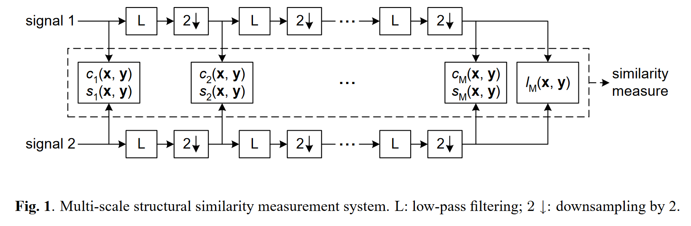

# 立体匹配中的评价指标

记录立体匹配中的评价指标，包括视差估计指标、图像相似度指标、光流估计指标等。

>点击[这里](https://github.com/jiayuzhang128/Knowledge-Base/blob/master/notes/research/%E7%AB%8B%E4%BD%93%E5%8C%B9%E9%85%8D%E4%B8%AD%E7%9A%84%E8%AF%84%E4%BB%B7%E6%8C%87%E6%A0%87/examples.ipynb) 查看jupyter notebook

## :framed_picture: 图像相似度指标

在立体匹配中图像的相似性指标如PSNR、SSIM和MS-SSIM等常作为损失函数进行立体匹配网络的训练。

### PSNR（Peak Signal-to-Noise Ratio）峰值信噪比

[skimage-mse接口地址](https://scikit-image.org/docs/stable/api/skimage.metrics.html#skimage.metrics.mean_squared_error)

[skimage-psnr接口地址](https://scikit-image.org/docs/stable/api/skimage.metrics.html#skimage.metrics.peak_signal_noise_ratio)

定义：给定一个大小为$m \times n$的干净图像I和噪声图像K

+ 均方误差MSE定义为：

$$MSE = \frac{1}{mn}\sum^{m-1}_{i=0}\sum^{n-1}_{j=0}[I(i,j)-K(i,j)]^{2}$$

+ 峰值信噪比PSNR定义为：

$$PSNR = 10 log_{10}(\frac{MAX^{2}_{I}}{MSE})$$

> 像素值取0-255时$MAX_{I}=255$，像素值取0-1时$MAX_{I}=1$
> 
> python中可以调用`psnr = skimage.metrics.peak_signal_noise_ratio(im1, im2, 255)`

### SSIM（Structural SIMilarity）结构相似性

结构相似性更符合人类评价标准。

[SSIM 研究主页](https://ece.uwaterloo.ca/~z70wang/research/ssim/)

[SSIM 论文](https://ece.uwaterloo.ca/~z70wang/publications/ssim.pdf)

[skimage-ssim接口地址](https://scikit-image.org/docs/stable/api/skimage.metrics.html#skimage.metrics.structural_similarity)

定义：对比样本$x$和$y$的**亮度（luminance)**、**对比度（contrast）**和**结构(structure)**。

+ 亮度、对比度和结构三个分量对比计算公式：

$$ l(x,y) = \frac{2\mu_{x}\mu_{y}+c_{1}}{\mu^{2}_{x}+\mu^{2}_{y}+c_{1}}$$

$$ c(x,y) = \frac{2\sigma_{x}\sigma_{y}+c_{2}}{\sigma^{2}_{x}+\sigma^{2}_{y}+c_{2}}$$

$$ s(x,y) = \frac{\sigma_{xy}+c_{3}}{\sigma_{x}\sigma_{y}+c_{3}}$$

+ 结构相似性SSIM计算公式：

$$SSIM = [l(x,y)^{\alpha} \dot c(x,y)^{\beta} \dot s(x,y)^{\gamma}]$$

> 取$\alpha=\beta=\gamma=1$

$$SSIM=\frac{(2\mu_{x}\mu_{y}+c_{1})(2\sigma_{xy}+c_{2})}{(\mu^{2}_{x}+\mu^{2}_{y}+c_{1})(\sigma^{2}_{x}+\sigma^{2}_{y}+c_{2})}$$

> **SSIM最大值为1**
> 
> $c_{3}$、$\alpha$、$\beta$和$\gamma$是超参数，经验参考值如：$c_{3}=c_{2}/2、\alpha=\beta=\gamma=1$
> 
> $\mu_{x}、\mu_{y}$为$x$和$y$的均值，$\sigma_{xy}$为$x$和$y$的协方差，$\sigma^{2}_{x}、\sigma^{2}_{x}$为$x$和$y$的方差
> 
> 常数$c_{1}=(k_{1}L)^{2},c_{2}=(k_{2}L)^{2}$可以避免分母为0，$k_{1}=0.01,k_{2}=0.03$为默认值，$L=2^{B}-1$为图片像素的取值范围，$B$为图像位数。
>
> python中可以调用`ssim = skimage.metrics.structural_similarity(im1, im2, 255)`

每次计算的时候都从图片上取一个的窗口，然后不断滑动窗口进行计算，最后取平均值作为全局的 SSIM。

针对超光谱图像，我们需要针对不同波段分别计算 SSIM，然后取平均值，这个指标称为 MSSIM。

### MS-SSIM（Multi-scale Structural SIMilarity）多尺度结构相似性

[MS-SSIM 论文](https://ece.uwaterloo.ca/~z70wang/publications/msssim.pdf)

[pytorch-msssim源码Github地址](https://github.com/VainF/pytorch-msssim)

[pytorch-msssim包地址](https://pypi.org/project/pytorch-msssim/)

图片按照一定规则，由大到小缩放，下面是MS-SSIM的计算过程图：

计算公式如下：

$$ MS-SSIM(x,y) = [l_{M}(x,y)]^{\alpha_{M}} * \prod \limits_{j = 1}^{M}([c_{j}(x,y)]^{\beta_{j}} * [s_{j}(x,y)]^{\gamma_{j}})$$

> M一般取5，也就是缩小4次的尺度加上原始尺度，共5个尺度
>
> $\alpha_{M},\beta_{j},\gamma_{j}$为相关重要性权重：
>
> + $\alpha_{M}$表示最后一个尺度的亮度相关重要性权重
>
> + $\beta{j}$表示第j个尺度的对比度相关重要性权重
>
> + $\gamma{j}$表示第j个尺度的结构相关重要性权重
>
> 论文中这些参数标定为：$\beta_{1}=\gamma_{1}=0.0448,\beta_{2}=\gamma_{2}=0.2856,\beta_{3}=\gamma_{3}=0.3001,\beta_{4}=\gamma_{4}=0.2363,\alpha_{5}=\beta_{5}=\gamma_{5}=0.1333$

