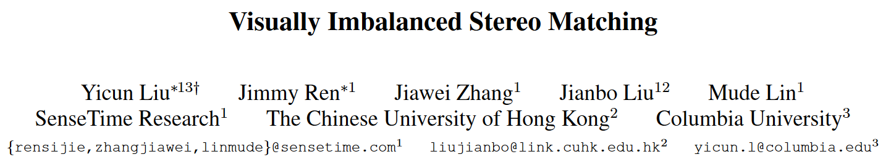

## 摘要

本文对目前流行的立体匹配算法进行了系统的比较，研究了各种不平衡条件对匹配算法的影响。

我们表明：

+ 与人类视觉系统类似，立体匹配算法可以处理一定程度的单目退化，但超过一定阈值会出现“立体崩溃”。
+ 为了避免在阈值以外出现“立体崩溃”，我们提出了一种**引导视图恢复+立体重建**的联合框架。

## 1、介绍

### 1.1 背景

现代智能手机中普遍采用**双摄相机（dual-lens）**，双摄的组合可以是彩色+彩色，彩色+黑白等。本文考虑的组合是视觉质量不平衡的双摄，即高分辨率的主相机（master camera）和低分辨率的从相机（slave camera）的立体匹配。

其实无论是人眼视觉系统或者计算机视觉系统，在进行立体匹配时对低分辨率的图像都具有一定的鲁棒性。即使右图比较模糊，立体匹配算法也能较好的估计视差。毕竟很多算法采用多尺度匹配策略，图像通常先降到较低的分辨率提取特征，再逐渐由粗到精恢复原分辨率的视差图。

### 1.2 不平衡条件设置

在许多现实世界的情况下，左视图和右视图的视觉质量并不保证匹配。

+ 人的立体视在双眼视觉中出现不同程度的**偏瘫和散光**是很常见的；
+ 对于计算机视觉来说，主从相机在双镜头模块中具有不同的**分辨率**、**镜头模糊度**、**成像方式**、**噪声容限**和**校正精度**。

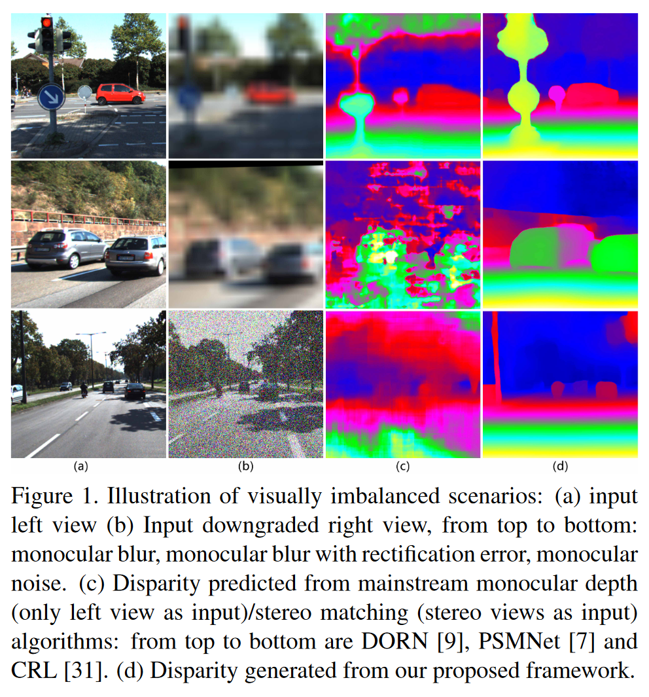

> （a）左图
>
> （b）退化右图，从上到下：**单目模糊**、**带矫正误差的单目模糊**和**单目噪声**
>
> （c）预测视差图，从上到下：DORN（单目cvpr2018）、PSMNet（双目cvpr2018）、CRL（双目cvpr2017）
>
> （d）预测视差图，本文方法

### 1.3 本文方法

**先用主视图中的高质量纹理恢复损坏的视图，然后进行立体匹配**。

+ **引导视图恢复**：受损视图（右图）中的**结构信息**作为引导视图，将高质量视图（左图）的纹理移位到匹配的合成右图对应区域，设计了一个**结构感知位移预测网络**来实现该过程；
+ **视差重构**：利用原始左图和恢复后的右图进行立体匹配

>  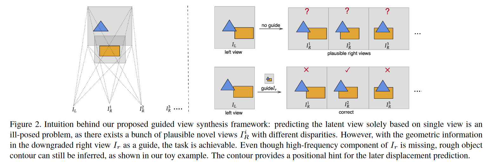
>
> 有受损视图（右图）的结构信息引导，能够更好从主视图（左图）恢复合成视图

### 1.4 主要贡献

+ 本文工作首次考虑不平衡条件进行立体匹配。发现人类视觉系统和计算机视觉对视觉不平衡感知都有一定**鲁棒性**。
+ 探讨了现有的算法在视觉不平衡立体匹配任务上的潜力，并**测试了出现“立体崩溃”的阈值**。
+ 利用了一个**引导视图合成框架**来恢复损坏的视图并解决其他场景“立体崩溃”问题。

## 2、相关工作

+ 深度感知
+ 人类立体视觉
+ 不平衡视图
+ 图像增强
+ 视图合成

## 3、探究不平衡立体视觉

### 3.1 动机与假设

+ **动机**：人类视觉系统对不平衡立体匹配具有一定的鲁棒性
+ **假设**：立体匹配算法对不平衡立体匹配也有一定的鲁棒性

> 接下来验证假设

### 3.2 对比与基准

#### 3.2.1 测试设置

+ **不平衡因素**：主要考虑**单目模糊**

+ **生成方法**：在测试配置中，右视图首先按比例因子下采样，然后上采样到其原始分辨率

+ **不平衡程度**：8种模糊程度，1X, 2X, 3X, 5X, 8X, 10X, 15X, 20X

+ **被测算法**：SGBM，DispNetC，CRL，PSMNet

+ **数据集**：KITTI

+ **评价指标**：D1-bg、D1-fg、D1-all

  + > D1：评估第一帧图像
    >
    > bg(Background Regions)：背景区域；fg(Foreground Regions)：前景区域；all(All Region)：全部区域
    >
    > 若视差或流端点误差$∣d_{est} − d_{gt}∣ < 3px$ 或$ \frac{{|d_{est}(x,y)-d_{gt}(x,y)|}}{d_{gt}}<5\% $则视为正确估计

+ **基准**：选择最近基于视图合成的**单目深度估计网络（Single view stereo matching，SVS，CVPR2018）**作为视差预测的基线。

  + > 理由：双目立体匹配算法至少应该利用损坏视图中的低频信息（轮廓等）
    >
    > 这意味着：如果双目立体匹配的结果优于只输入高质量左视图的结果时，认为没有发生“立体崩溃”，反之亦然。

#### 3.2.2 测试结果

+ 测试结果数据表格

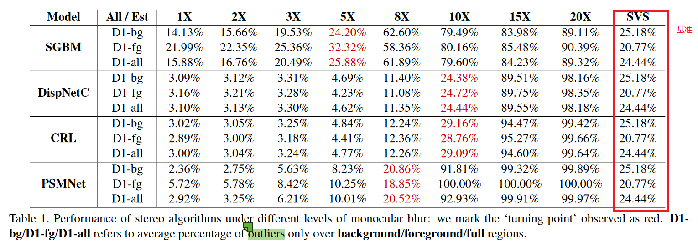

> 以单目左图作为输入构建各个模型的基准，这里红色标注的是性能低于baseline的拐点

+ 测试结果折线图

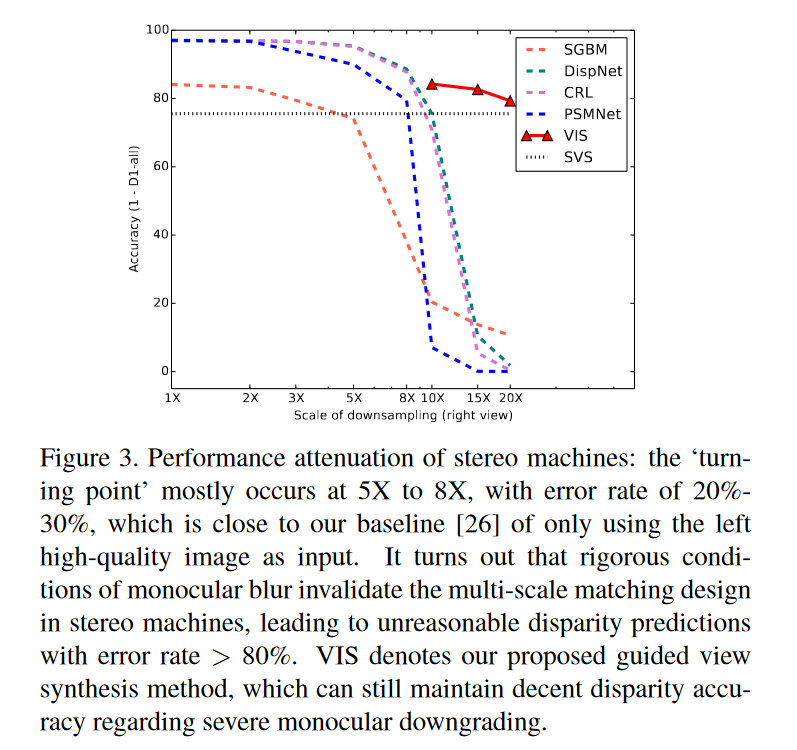

### 3.3 结果分析

+ **立体匹配算法具有一定的鲁棒性**，但随着模糊程度的加深，传统算法和深度学习算法的错误率都逐渐增大；

+ **当右图模糊到什么程度时，立体匹配算法会失效？**模糊程度大于5、8、10倍时，立体匹配算法就失效了；
+ ==为了解决立体匹配算法超过不平衡阈值就失效的问题==，提出了**引导视图恢复+立体重建**的联合框架

##4、视觉不平衡立体匹配网络

### 4.1 网络结构图

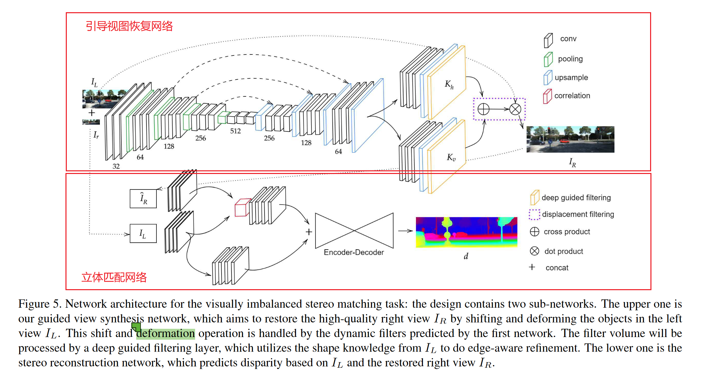

整个网络分为两个阶段：**恢复受损视图+立体匹配**

### 4.2 引导视图恢复

引导视图恢复的思想是：**受损视图的结构信息作为指导，将高质量左图的纹理信息移位到合成右图上**

视图恢复网络有两个关键滤波层：**动态移位滤波层**和**深度引导滤波层**

#### 4.2.1 动态移位滤波层

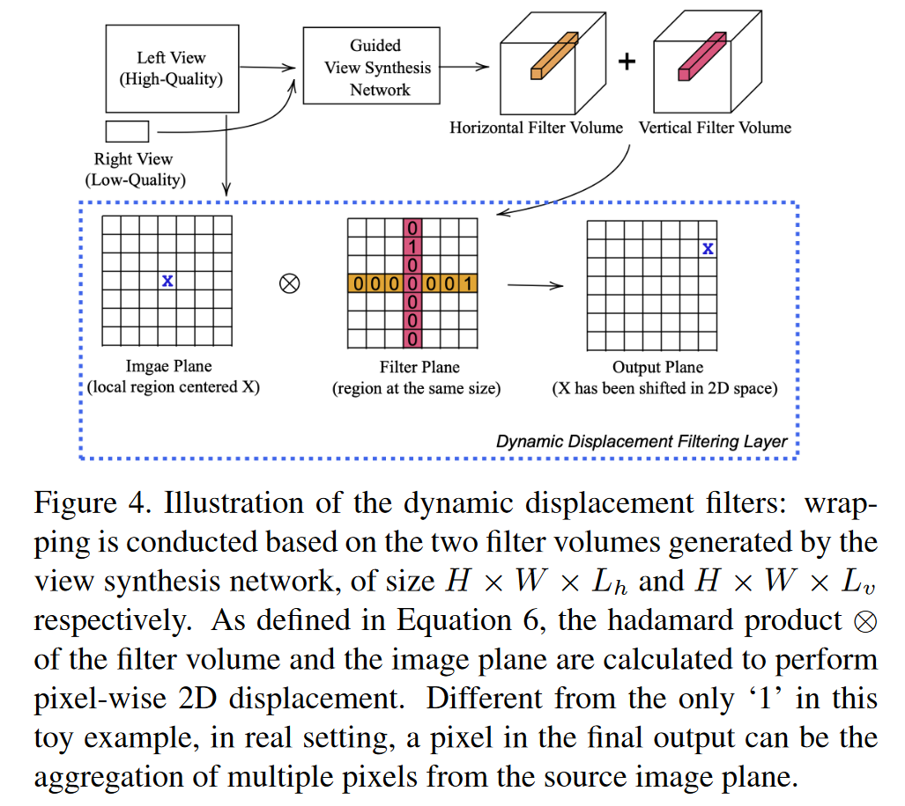

通过引导视图合成网络来学习左右图在边缘轮廓上的匹配情况，从而生成一个水平方向的滤波器$L_{h}$和一个竖直方向的滤波器$L_{v}$ ，大小分别是$H×W×L_{h}$和$H×W×L_{v}$，用来表示右图相对于左图的偏移。**为了减少内存占用量，采用两个一维滤波器的组合**，而不是学习一个二维滤波器。

之后利用高质量的左图作为参考，利用$L_{h}$和$L_{v}$的移位信息，即可将左图的纹理在二维空间上移位，得到高质量的右图。

上述过程可用公式表示为：

$$\hat{I}_{R}(i,j)=(K_{h}(i,j)×K_{v}(i,j)^{T})⊗P_{L}(i,j)$$

其中$K_{h}(i,j)$和$K_{v}(i,j)$分别是网络预测得到的一维线性偏移滤波器，它们俩的内积可以近似表示二维线性偏移滤波器，$P_{L}(i,j)$是左图的图像块。以此操作可以得到恢复的高质量右图$\hat{I}_{R}(i,j)$。

#### 4.2.2 深度引导滤波层

**为了进一步的优化边缘信息**，可以采用左图中的目标形状知识来对$L_{h}$和$L_{v}$进行**引导滤波**。

原始的**引导滤波算法（Guided Image Filtering）**是何恺明在2013年的PAMI上提出的。这是一个在引导图像$G$和滤波输出$O$之间的局部线性模型：

$$O_{i}=a_{k}G_{i}+b_{k},∀i \in ω_{k}$$

其中$ω_{k}$是以像素$k$为中心的局部窗口，线性系数$(a_{k},b_{k})$是窗口$\omega_{k}$内的常数。这个局部线性模型确保输出$O$有边缘当且仅当$G$有边缘。并且，滤波输出$O_{i}$ 应当与输入$P_{i}$ 相似，通过最小化下述公式：

$$E(a_{k},b_{k})=\sum{}{k:i \in \omega_{k}}((O_{i}−P_{i})^{2}+ϵa_{k}^{2})$$

这里 ϵ 是一个正则化参数。在本文中，作者以左图作为引导$G$， 以滤波体$K_{h}[d]$的第d个切片作为输出$O$，那么线性变换可以写作：

$$(I_{L})_{i}=\frac{1}{ω}\sum{}{k:i \in ω_{k}}(a_{k}⋅(K_{h}[d])_{i}+b_{k})=\bar{a}_{i}(K_{h}[d])i+\bar{b}_{i}$$

本文采用引导滤波的加速的，完全可导的版本——深度引导滤波，作为$L_{h}$和$L_{v}$的位移学习的最后一层网络。

#### 4.2.3 损失函数

引导视图恢复网络的损失函数包括**图像层面的光度损失**和**特征层面的感知损失**。

+ **图像光度损失**：$$\mathcal{L}_{pixel}=\alpha * \parallel \hat{I}_{R}-I_{R} \parallel_{1}+(1-\alpha) * (\hat{I}_{R},I_{R})_{MS-SSIM}$$
+ **特征感知损失**：$$\mathcal{L}_{feat}=\frac{1}{\mathcal{C}_{j}\mathcal{H}_{j}\mathcal{W}_{j}}\parallel \psi_{j}(\hat{I}_{R})-\psi_{j}(I_{R})\parallel_{2}$$
+ **复合损失**：$$\mathcal{syn}=\beta*\mathcal{L}_{pixel}+(1-\beta)*\mathcal{feat}$$

### 4.3 立体匹配

#### 4.3.1 网络结构

**选择DispNet基于左视图$I_{L}$和恢复的右视图$\hat{I}_{R}$进行立体重建**。

网络遵循[Cascade residual learning: A two-stage convolutional neural network for stereo matching. ICCVW2017]中的修改，采用DispFulNet结构进行全分辨率视差输出。在该网络中

+ $I_{L}$和$\hat{I}_{R}$首先被传递到具有共享权重的几个卷积层。
+ 然后，生成的特征图将由相关层处理，该层将几何线索嵌入到不同水平面片的相关中。由相关层输出的特征图将与来自左图像$I_{L}$的更高级特征图连接。
+ 最后，在编码器-解码器结构之后，网络进一步细化特征图并输出最终视差图$d$。

#### 4.3.2 损失函数

最后采用多尺度的L1范数进行有监督回归学习

$$\mathcal{L}_{disp}=\sum^{N}_{n=1} \parallel \hat{d}_{n}-d_{n} \parallel _{1}$$

## 5、实验

### 5.1 实验设置

+ **数据集**：本文以KITTI Raw Data作为训练，在KITTI 2015上评测

+ **评价指标**：
  + 以光度评测指标**PSNR**和**SSIM**来评估引导视图恢复网络，
  + 以**D1**指标评估视差估计网络

+ **不平衡因素**：
  + 单目模糊（Monocular Blur）：10倍，15倍和20倍；
  + 校正误差（Rectification Error）：最大程度为0.5和1.0；
  + 设备噪声（Sensor Noise）：高斯噪声方差为0.5和1.0；

### 5.2 实验结果

#### 5.2.1 定性实验结果

##### 合成视图效果

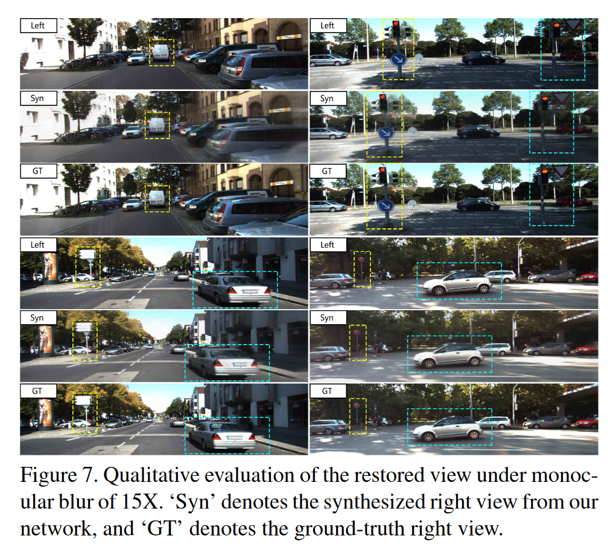

##### 视差预测效果

> （a）从上至下是10X模糊，15X模糊， σ=0.5高斯噪声， σ=1.0高斯噪声，10X模糊+0.5校正误差，10X模糊+1.0校正误差。
>
> （b）PSMNet
>
> （c）CRL
>
> （d）DORN
>
> （e）本文的方法

##### 实际场景效果

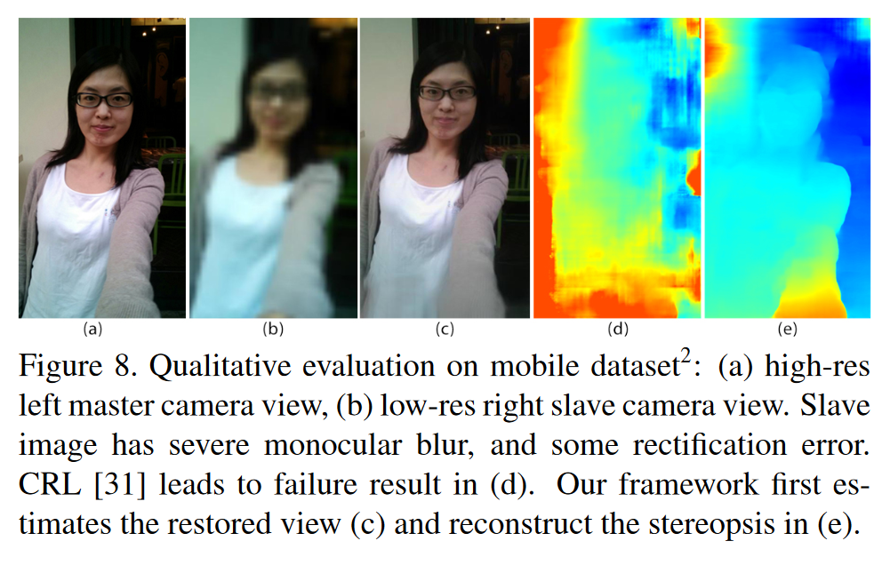

> （a）高分辨率左图
>
> （b）带有单目模糊和校正误差的右图
>
> （c）合成右图
>
> （d）CRL预测视差
>
> （e）本文方法预测视差

#### 5.2.2 定量实验结果

##### 单目模糊

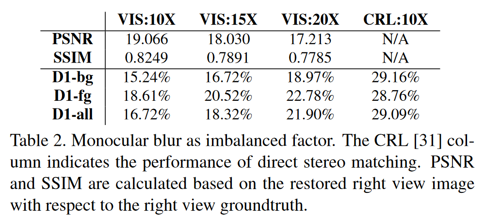

##### 校正误差

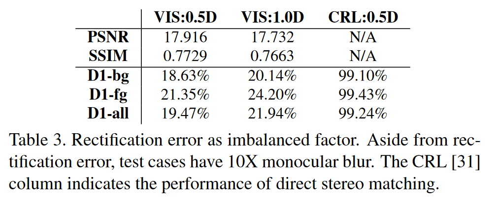

##### 高斯噪声

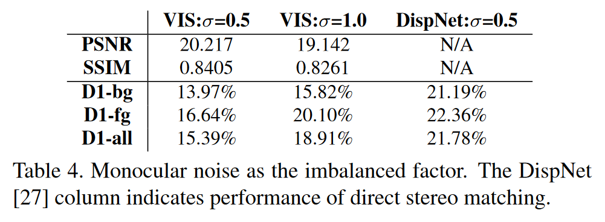

## 6、 总结

视觉不平衡立体匹配希望将低质量的右图恢复到高质量再进行立体匹配，其解决思路是：**将新出现的场景和任务还原回经典的场景去解决**

## 接下来的计划

psnr ssim ms-ssim

视觉不平衡深入调研

分类法

各数据集的评价指标

## 我的想法

问题不同焦距，引起视场不同

方案：引导视图恢复（大视场向小视场转换，还能保留大视场的更多信息）+立体重建
